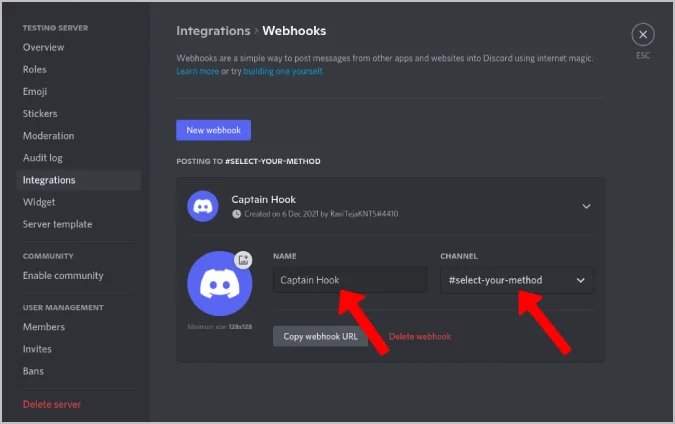

# Discord Integration

This guide explains how to set up and configure Discord notifications for Solana Insider Monitor.

## Setting Up Discord Webhooks

Solana Insider Monitor can send alerts directly to Discord channels using webhooks. Here's how to set it up:

### Step 1: Create a Webhook in Discord

1. Open Discord and navigate to the server where you want to receive alerts
2. Right-click on the channel and select **Edit Channel**
3. Go to **Integrations** > **Webhooks**
4. Click **New Webhook**
5. Give your webhook a name (e.g., "Solana Monitor")
6. Optionally, customize the avatar
7. Click **Copy Webhook URL** - you'll need this for configuration
8. Click **Save**



### Step 2: Configure Solana Insider Monitor

Add the webhook URL to your configuration:

```json
{
    "discord": {
        "enabled": true,
        "webhook_url": "https://discord.com/api/webhooks/your-webhook-url",
        "channel_id": "your-channel-id"
    }
}
```

- **enabled**: Set to `true` to enable Discord notifications
- **webhook_url**: The Discord webhook URL you copied in Step 1
- **channel_id**: Optional channel ID for mentions (if different from webhook channel)

## Webhook Message Format

Discord alerts include the following information:

- Wallet address with explorer link
- Token name and symbol
- Balance change amount and percentage
- Timestamp of the change
- Alert severity level indicator

Different alert levels use different colors:
- **Info** (Blue): Minor changes
- **Warning** (Yellow): Moderate changes
- **Critical** (Red): Major changes

## Troubleshooting

### Webhook Testing

You can test your Discord webhook manually by using a cURL command:

```bash
curl -X POST -H "Content-Type: application/json" \
  -d '{"content": "Test message from Solana Insider Monitor"}' \
  YOUR_WEBHOOK_URL
```

Replace `YOUR_WEBHOOK_URL` with your actual webhook URL.

### Common Issues

- **No alerts appearing**:
  - Check that `enabled` is set to `true`
  - Verify the webhook URL is correct and hasn't been regenerated
  - Ensure the Discord server/channel still exists

- **Rate limiting**:
  - Discord may rate limit webhooks if too many messages are sent
  - Consider increasing the `significant_change` threshold

- **Formatting issues**:
  - Make sure the webhook has permission to use embeds
  - Check Discord server settings for webhook permissions

## Best Practices

1. **Create a dedicated channel** for monitor alerts to avoid cluttering general channels
2. **Set clear channel descriptions** to help users understand the alert purpose
3. **Use Discord's notification settings** to control when you get notified
4. **Regularly check webhook status** if alerts suddenly stop

## Planned Enhancements

We're planning to add more advanced Discord features in future versions. See the [Feature Ideas](../developer/feature-ideas.md#alert-system-improvements) document for details on upcoming improvements.

## Related Settings

- [Alert Settings](alert-settings.md) - Configure alert thresholds
- [Wallet Settings](wallet-settings.md) - Manage monitored wallets
