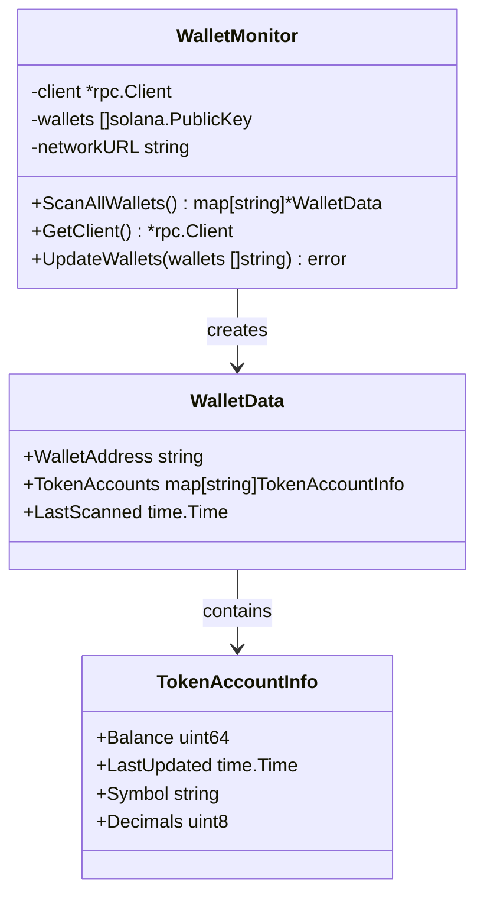
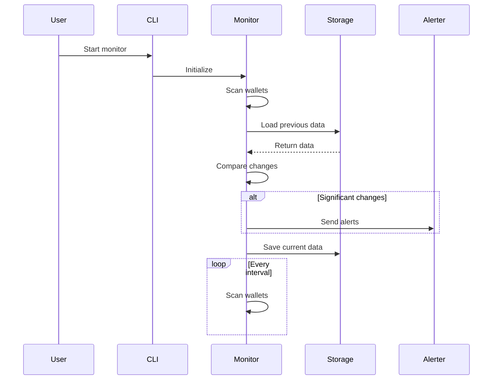

# Project Structure

This guide explains the structure of the Solana Insider Monitor codebase to help developers understand and contribute to the project.

## Directory Overview

```
insider-monitor/
├── cmd/                    # Command line entry points
│   └── monitor/            # Main application entry point
├── internal/               # Private application packages
│   ├── alerts/             # Alert generation and delivery
│   ├── auth/               # Authentication for web interface
│   ├── config/             # Configuration management
│   ├── monitor/            # Core wallet monitoring
│   ├── storage/            # Data persistence
│   ├── utils/              # Shared utilities
│   └── web/                # Web interface and API
├── data/                   # Data storage directory
├── docs/                   # Documentation
├── bin/                    # Compiled binaries
├── config.json             # Application configuration
├── config.example.json     # Example configuration
├── go.mod                  # Go module definition
├── go.sum                  # Go module checksums
├── Makefile                # Build and development tasks
└── README.md               # Project documentation
```

## Core Modules

### Command Line Interface (`cmd/`)

The `cmd/` directory contains the main entry points for the application:

- `cmd/monitor/main.go` - Main application entrypoint with CLI flags

```go
// Main entry point for the application
func main() {
    // Parse command line flags
    testMode := flag.Bool("test", false, "Run in test mode")
    webMode := flag.Bool("web", false, "Run with web UI")
    configPath := flag.String("config", "config.json", "Path to config file")
    // ...
}
```

### Monitoring System (`internal/monitor/`)

The monitoring system is responsible for scanning wallets and detecting changes:

- `monitor.go` - Core functionality for wallet scanning
- `mock_wallet.go` - Mock implementation for testing



The `WalletMonitor` connects to Solana's RPC API to fetch wallet data and detect changes.

### Alert System (`internal/alerts/`)

The alert system processes significant changes and delivers notifications:

- `alerts.go` - Alert interface and types
- `discord.go` - Discord webhook integration

```go
// Alerter interface defines the contract for alert delivery
type Alerter interface {
    SendAlert(alert Alert) error
}

// Alert represents a notification about a significant change
type Alert struct {
    Timestamp     time.Time
    WalletAddress string
    TokenMint     string
    AlertType     string
    Message       string
    Level         AlertLevel
    Data          map[string]interface{}
}
```

### Configuration (`internal/config/`)

Handles loading, validating, and updating configuration:

- `config.go` - Configuration structure and loading
- `update.go` - Configuration update logic

```go
// Config represents the application configuration
type Config struct {
    NetworkURL   string   `json:"network_url"`
    Wallets      []string `json:"wallets"`
    ScanInterval string   `json:"scan_interval"`
    Alerts       struct {
        MinimumBalance    float64  `json:"minimum_balance"`
        SignificantChange float64  `json:"significant_change"`
        IgnoreTokens      []string `json:"ignore_tokens"`
    } `json:"alerts"`
    Discord struct {
        Enabled    bool   `json:"enabled"`
        WebhookURL string `json:"webhook_url"`
        ChannelID  string `json:"channel_id"`
    } `json:"discord"`
    mu       sync.RWMutex `json:"-"`
    filepath string       `json:"-"`
}
```

### Storage System (`internal/storage/`)

Manages persistent storage of wallet data:

- `storage.go` - File-based data storage

```go
// Storage handles persisting wallet data to disk
type Storage struct {
    dataDir string
}

// LoadWalletData loads wallet data from disk
func (s *Storage) LoadWalletData() (map[string]*monitor.WalletData, error) {
    // ...
}

// SaveWalletData saves wallet data to disk
func (s *Storage) SaveWalletData(data map[string]*monitor.WalletData) error {
    // ...
}
```

### Web Interface (`internal/web/`)

Provides a web UI and REST API:

- `server.go` - HTTP server and API handlers
- `templates/` - HTML templates
- `static/` - Static assets (CSS, JS, images)

```go
// Server represents the web server
type Server struct {
    config       *config.Config
    monitor      *monitor.WalletMonitor
    storage      *storage.Storage
    port         int
    router       *http.ServeMux
    tokenManager *auth.TokenManager
}

// Start starts the web server
func (s *Server) Start() error {
    // ...
}
```

### Authentication (`internal/auth/`)

Handles authentication for the web interface and API:

- `auth.go` - Authentication logic
- `tokens.go` - JWT token management

```go
// TokenManager handles JWT token creation and validation
type TokenManager struct {
    secretKey []byte
    expiry    time.Duration
}

// CreateToken creates a new JWT token
func (tm *TokenManager) CreateToken(username string) (string, time.Time, error) {
    // ...
}

// ValidateToken validates a JWT token
func (tm *TokenManager) ValidateToken(tokenString string) (string, error) {
    // ...
}
```

## Request Flow

The following diagram illustrates the flow of a typical request through the system:



## Key Dependencies

The project relies on several external dependencies:

- [solana-go](https://github.com/gagliardetto/solana-go) - Go client for Solana blockchain
- [gorilla/mux](https://github.com/gorilla/mux) - HTTP router for the web interface
- [golang-jwt/jwt](https://github.com/golang-jwt/jwt) - JWT authentication
- [joho/godotenv](https://github.com/joho/godotenv) - Environment variable loading

## Build System

The project uses a Makefile to standardize build and development tasks:

```makefile
# Build the application
build:
    go build -o bin/insider-monitor cmd/monitor/main.go

# Run tests
test:
    go test -v ./...

# Generate code coverage
coverage:
    go test -coverprofile=coverage.out ./...
    go tool cover -html=coverage.out
```

## Testing Strategy

The project uses Go's built-in testing framework:

- Unit tests for individual components
- Mock implementations for external dependencies
- Integration tests for end-to-end functionality

Example test:

```go
func TestWalletMonitor_ScanAllWallets(t *testing.T) {
    // Set up test
    mock := NewMockRPCClient()
    monitor := &WalletMonitor{
        client: mock,
        wallets: []solana.PublicKey{testWallet},
    }

    // Execute test
    result, err := monitor.ScanAllWallets()

    // Assert results
    assert.NoError(t, err)
    assert.Len(t, result, 1)
    // ...
}
```

## Configuration Management

Configuration is handled through:

1. Default values
2. Configuration file (JSON)
3. Environment variables (override file settings)
4. Command line flags (highest priority)

## Next Steps

- [Contributing Guide](contributing.md) - Learn how to contribute to the project
- [Building from Source](building.md) - Build the project from source code
- [Testing](testing.md) - Run and write tests
