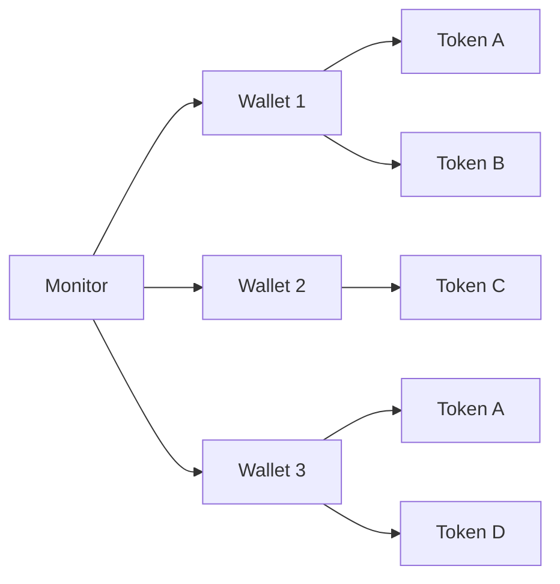

# Features Overview

Solana Insider Monitor comes packed with powerful features designed to give you visibility into Solana wallet activities. Here's an overview of what you can do with this tool.

## Core Features

-   :material-wallet-outline:{ .lg .middle } __Wallet Monitoring__

    ---

    Track multiple Solana wallets simultaneously with real-time balance updates and transaction monitoring.

    [:octicons-arrow-right-24: Learn More](wallet-monitoring.md)

-   :material-bell-ring:{ .lg .middle } __Alert System__

    ---

    Get notified about significant changes in token balances with customizable thresholds and multiple notification channels.

    [:octicons-arrow-right-24: Learn More](alert-system.md)

-   :material-web:{ .lg .middle } __Web Interface__

    ---

    Monitor wallets through an intuitive web dashboard with detailed visualizations and configuration options.

    [:octicons-arrow-right-24: Learn More](web-interface.md)

-   :material-database:{ .lg .middle } __Storage System__

    ---

    Store historical wallet data with persistent storage to track changes over time and prevent false alerts.

    [:octicons-arrow-right-24: Learn More](storage-system.md)

## Feature Highlights

### Multi-Wallet Monitoring

Monitor an unlimited number of Solana wallets simultaneously, with each wallet's tokens tracked independently. Perfect for tracking multiple accounts, projects, or investment portfolios.

### Advanced Token Filtering

Control exactly which tokens are monitored with flexible scan modes:

- **Global configuration**: Set default scan behavior for all wallets
- **Per-wallet customization**: Configure different scan modes for different wallets
- **Three scan modes**:
    - **All**: Monitor all tokens in a wallet
    - **Whitelist**: Only monitor specific tokens you care about
    - **Blacklist**: Monitor all tokens except those you specify

This allows you to focus on important tokens and reduce noise from airdrops or dust.

### Real-Time Alerts

Receive instant notifications when significant token balance changes are detected:

- 🟢 **Info level** for minor changes
- 🟡 **Warning level** for moderate changes
- 🔴 **Critical level** for major changes

### Discord Integration

Get alerts directly in your Discord server with rich, formatted messages containing:

- Wallet address with explorer link
- Token name and symbol
- Balance change amount and percentage
- Timestamp of the change
- Alert severity indicator

### Web Dashboard

Access a comprehensive web dashboard with:

- Overview of all monitored wallets
- Detailed token balance information
- Historical balance changes
- Configuration management interface
- Secure authentication

### API Access

Integrate with other systems using our REST API:

- Fetch wallet data programmatically
- Update configuration settings
- Add or remove wallets from monitoring
- Secure JWT authentication

## Available Capabilities

Solana Insider Monitor is a fully open-source application with all features freely available to all users:

- **Unlimited wallet monitoring** - Track as many wallets as you need
- **Configurable scan frequency** - Adjust polling intervals based on your needs
- **Multiple alert channels** - Console, Discord, and extensible for more integrations
- **Comprehensive web interface** - Full-featured dashboard and configuration UI
- **Complete API access** - Integrate with other systems and services
- **Historical data storage** - Track and analyze changes over time
- **Customizable alerts** - Set thresholds and conditions to match your requirements
- **Self-hosted** - Run on your own infrastructure for maximum privacy and control

## Feature Roadmap

We're constantly improving Solana Insider Monitor. Here are some features planned for upcoming releases:

- **Transaction Monitoring**: Track specific transaction types
- **Smart Alerts**: AI-powered alert significance detection
- **Portfolio Analysis**: Calculate total portfolio value across wallets
- **Mobile App**: Native mobile applications for iOS and Android
- **Custom Webhooks**: Integrate with any service supporting webhooks
- **Expanded Blockchain Support**: Monitor other chains like Ethereum and Bitcoin

!!! info "Feature Requests"
    Have a feature idea? Join our [Discord community](https://discord.gg/7vY9ZBPdya) to suggest new features or vote on existing ones!
