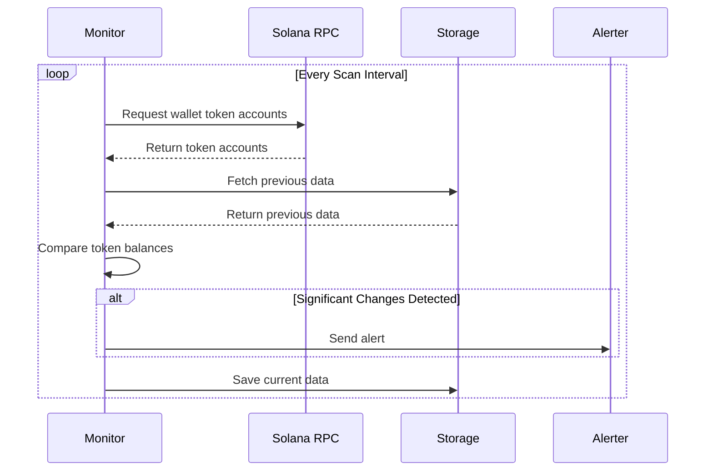

# Wallet Monitoring

The core functionality of Solana Insider Monitor is its ability to track Solana wallets and monitor their token balances in real-time. This page explains how the wallet monitoring system works and how to use it effectively.

## How It Works

Solana Insider Monitor connects to the Solana blockchain through RPC endpoints and periodically scans wallet addresses to:

1. Retrieve token accounts associated with each wallet
2. Fetch current balances for all tokens
3. Compare with previous balances to detect changes
4. Generate alerts for significant changes
5. Store the data for future reference

The process repeats based on your configured scan interval, providing near real-time monitoring of wallet activities.



## Token Account Detection

For each wallet address, Solana Insider Monitor automatically detects:

- SOL balance (native token)
- All SPL tokens held by the wallet
- Token metadata (symbol, name, decimals)
- Token account addresses

## Balance Comparison

The monitor compares current balances with previously recorded balances to calculate:

- Absolute balance change (token amount)
- Percentage change
- Whether the change exceeds your configured thresholds

## Monitoring Multiple Wallets

Solana Insider Monitor can track an unlimited number of wallet addresses simultaneously. To add wallets:

1. Edit your `config.json` file:
   ```json
   {
       "wallets": [
           "55kBY9yxqQzj2zxZqRkqENYq6R8PkXmn5GKyQN9YeVFr",
           "DWuopnuSqYdBhCXqxfqjqzPGibnhkj6SQqFvgC4jkvjF",
           "Another_Wallet_Address"
       ]
   }
   ```

2. Or use the web interface:
   - Navigate to Settings > Wallets
   - Add new wallet addresses
   - Save changes

## Scan Interval Configuration

You can configure how frequently the monitor scans wallets:

```json
{
    "scan_interval": "30s"  // Scan every 30 seconds
}
```

Common interval formats:
- `30s` - 30 seconds
- `1m` - 1 minute
- `5m` - 5 minutes
- `1h` - 1 hour

!!! tip "Scan Interval Considerations"
    Shorter intervals provide more real-time data but increase RPC usage.
    Consider using longer intervals (5-15 minutes) for non-critical monitoring
    or when using public RPC endpoints that may have rate limits.

## Error Handling

Solana Insider Monitor includes robust error handling to deal with network issues:

- **Automatic Retry**: If a scan fails, the monitor will automatically retry
- **Exponential Backoff**: Progressively longer delays between retries to avoid overwhelming the network
- **Connection Monitoring**: Detection of network connectivity issues with alerts when connection is lost or restored
- **Data Persistence**: Historical data is preserved during outages to avoid false alerts when connectivity is restored

## Viewing Wallet Data

### Console Output

When running in console mode, wallet scan results are output to the terminal:

```
[INFO] 2023-05-15T08:30:00Z: Scanning wallets...
[INFO] 2023-05-15T08:30:01Z: Wallet 55kBY9yxqQzj2zxZqRkqENYq6R8PkXmn5GKyQN9YeVFr has 5 token accounts
[INFO] 2023-05-15T08:30:01Z: Wallet DWuopnuSqYdBhCXqxfqjqzPGibnhkj6SQqFvgC4jkvjF has 3 token accounts
```

### Web Interface

The web interface provides a more visual representation of wallet data:

1. **Dashboard Overview**: Summary of all monitored wallets
2. **Wallet Detail View**: Detailed information about each wallet's tokens
3. **Balance History**: Visual representation of balance changes over time


## Advanced Features

### Token Filtering

Solana Insider Monitor provides multiple ways to control which tokens are monitored:

#### 1. Scan Modes

The monitor supports three different scanning modes:

- **all**: Monitor all tokens in the wallet (default)
- **whitelist**: Only monitor tokens specified in the `include_tokens` list
- **blacklist**: Monitor all tokens except those in the `exclude_tokens` list

You can set a global scan mode for all wallets:

```json
{
    "scan": {
        "scan_mode": "blacklist",
        "include_tokens": [],
        "exclude_tokens": [
            "EPjFWdd5AufqSSqeM2qN1xzybapC8G4wEGGkZwyTDt1v",  # USDC
            "Es9vMFrzaCERmJfrF4H2FYD4KCoNkY11McCe8BenwNYB"   # USDT
        ]
    }
}
```

#### 2. Per-Wallet Scan Configuration

You can also configure different scan modes for individual wallets:

```json
{
    "wallet_configs": {
        "55kBY9yxqQzj2zxZqRkqENYq6R8PkXmn5GKyQN9YeVFr": {
            "scan": {
                "scan_mode": "whitelist",
                "include_tokens": [
                    "So11111111111111111111111111111111111111112",  # SOL
                    "EPjFWdd5AufqSSqeM2qN1xzybapC8G4wEGGkZwyTDt1v"  # USDC
                ],
                "exclude_tokens": []
            }
        }
    }
}
```

This allows you to monitor different tokens for different wallets - for instance, you might want to:
- Monitor only SOL and major tokens in your main wallet
- Monitor all tokens except airdrops in a trading wallet
- Monitor all tokens in a new or experimental wallet

#### 3. Alert Ignore List

For alerts only, you can specify tokens to ignore:

```json
{
    "alerts": {
        "ignore_tokens": [
            "EPjFWdd5AufqSSqeM2qN1xzybapC8G4wEGGkZwyTDt1v",  # USDC
            "Es9vMFrzaCERmJfrF4H2FYD4KCoNkY11McCe8BenwNYB"   # USDT
        ]
    }
}
```

This differs from scan modes because these tokens are still monitored and recorded, but don't generate alerts.

### Minimum Balance Threshold

Set a minimum balance threshold to avoid alerts for insignificant token amounts:

```json
{
    "alerts": {
        "minimum_balance": 1000
    }
}
```

Tokens with balances below this threshold won't trigger alerts, reducing noise from dust amounts.

### Custom RPC Endpoints

For better performance and reliability, you can configure a custom RPC endpoint:

```json
{
    "network_url": "https://your-custom-rpc-endpoint.com"
}
```

## Best Practices

1. **Start Small**: Begin by monitoring a few important wallets before adding more
2. **Adjust Thresholds**: Fine-tune alert thresholds to reduce noise from minor fluctuations
3. **Use Private RPC**: For production monitoring, use a private RPC endpoint for better reliability
4. **Regular Maintenance**: Periodically review and clean up your wallet list
5. **Group Related Wallets**: Use naming conventions or tags to group related wallets

## Troubleshooting

### Common Issues

- **High RPC Latency**: If scans are slow, try a different RPC endpoint
- **Rate Limiting**: Public RPCs may rate-limit requests; increase scan interval or use a private endpoint
- **Missing Token Metadata**: Some newer tokens may lack metadata; this doesn't affect balance monitoring
- **Large Number of Tokens**: Wallets with hundreds of tokens may take longer to scan

### Logs and Debugging

When troubleshooting, run the monitor with more verbose logging:

```bash
RUST_LOG=debug insider-monitor
```

This will provide more detailed information about the scanning process, RPC requests, and error handling.
